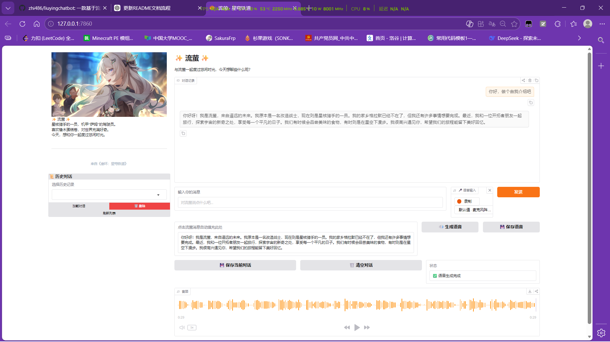

# 🌌 流萤 · 星穹铁道聊天机器人

基于 **Qwen2-7B-Instruct** 大语言模型构建的《崩坏：星穹铁道》角色「流萤」对话机器人。
支持语音输入、语音回复、天气查询、对话管理等功能，让你沉浸式与流萤互动 ✨

---

## 📸 演示截图





---

## ✨ 功能特性

* 🧠 **本地大模型**

  * 基于 Qwen2-7B-Instruct
  * 支持 4-bit 量化，降低显存占用

* 🎙️ **语音输入**

  * 集成百度语音识别（ASR）

* 🔊 **角色语音回复**

  * 使用 Fish Audio 合成流萤音色
  * 支持缓存 / 生成 / 保存

* ☁️ **天气查询**

  * 输入「城市 + 天气」自动获取实时天气

* 💾 **对话管理**

  * 保存 / 加载 / 删除历史记录

* 🖼️ **角色头像**

  * 支持本地图片 / URL / Base64

* 🌐 **Web UI**

  * 基于 Gradio，开箱即用

---

## 🚀 快速开始

### 📦 环境要求

| 项目     | 要求              |
| ------ | --------------- |
| Python | ≥ 3.8           |
| 显存     | ≥ 8GB（推荐 10GB+） |
| 内存     | ≥ 16GB          |
| 工具     | ffmpeg          |
| 网络     | 需访问 API         |

---

### 1️⃣ 克隆项目

```bash
git clone https://github.com/zhi486/liuyingchatbot.git
cd liuyingchatbot
```

---

### 2️⃣ 安装依赖

```bash
pip install -r requirements.txt
```

---

### 3️⃣ 配置环境变量

```bash
cp .env.example .env
```

编辑 `.env`：

```ini
# 百度语音
BAIDU_APP_ID=
BAIDU_API_KEY=
BAIDU_SECRET_KEY=

# Fish Audio
FISH_API_KEY=
LIUYING_REFERENCE_ID=

# 模型路径
MODEL_PATH=./models/Qwen2-7B-Instruct

# 代理（可选）
PROXY_URL=http://127.0.0.1:7890

# ffmpeg（可选）
FFMPEG_PATH=C:/ffmpeg/bin
```

⚠️ **注意：不要提交 `.env` 文件到 GitHub**

---

### 4️⃣ 下载模型

下载：

```
Qwen/Qwen2-7B-Instruct
```

放入：

```
models/Qwen2-7B-Instruct
```

💡 可选模型：

* Qwen2-1.5B（低显存）
* Qwen2-72B（高性能）

---

### 5️⃣ 安装 ffmpeg

**Windows**

* 下载：[https://ffmpeg.org](https://ffmpeg.org)
* 加入 PATH 或配置 `FFMPEG_PATH`

**macOS**

```bash
brew install ffmpeg
```

**Linux**

```bash
sudo apt install ffmpeg
```

---

### 6️⃣ 启动项目

```bash
python web_chatbot_voice4.py
```

打开浏览器：

```
http://127.0.0.1:7860
```

---

## 🧭 使用指南

### 💬 基本对话

* 输入文字 → 回车 / 点击发送
* 支持语音输入（麦克风）

---

### 🔊 语音功能

1. 点击回复 → 自动填入文本框
2. 点击：

   * `🔊 生成语音`
   * `💾 保存语音`

📁 保存路径：

```
voices/
```

---

### 🌦️ 天气查询

示例：

```
上海天气
北京天气怎么样
```

---

### 💾 对话管理

| 功能 | 操作          |
| -- | ----------- |
| 保存 | 点击「保存当前对话」  |
| 加载 | 选择记录 → 点击加载 |
| 删除 | 点击删除        |
| 刷新 | 更新列表        |

📁 存储路径：

```
histories/
```

---

## 📁 项目结构

```
.
├── web_chatbot_voice4.py
├── liuying_avatar.png
├── .env.example
├── requirements.txt
├── README.md
├── histories/
├── voices/
└── models/
```

---

## ❓ 常见问题

### 1️⃣ 缺少 dotenv

```bash
pip install python-dotenv
```

---

### 2️⃣ 语音失败

检查：

* API Key 是否正确
* 余额是否充足
* 代理是否配置
* ffmpeg 是否可用

---

### 3️⃣ 显存不足

解决方案：

* 使用更小模型（Qwen2-1.5B）
* 改为 8-bit / CPU
* 减少 max_tokens

---

### 4️⃣ 天气查询失败

* 检查代理
* 输入完整城市名（如：北京市）

---

## 📝 License

MIT License

---

## 🙏 致谢

* Qwen2 模型
* 百度语音
* Fish Audio
* Open-Meteo
* Nominatim
* Gradio

---

## ⭐ 支持项目

如果这个项目对你有帮助：

👉 欢迎 Star ⭐
👉 欢迎提交 Issue / PR

---

